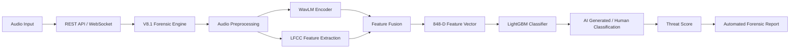
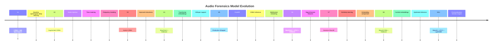

# 🎙️ Audio Forensics: AI for Voice Security

## 🛡️ Production-Grade AI Voice Deepfake Detection System

Audio Forensics is an AI-powered voice security platform designed to detect synthetic speech, AI-generated voices, and voice cloning attacks.

The system evolved through **8+ model generations**, moving from spectrogram-based deep learning into a production forensic engine combining:

* Transformer speech representations
* Signal-processing forensic features
* Siamese similarity learning
* Ensemble machine learning
* Real-time WebSocket inference

Supports:

✅ Static audio forensic analysis
✅ Real-time voice interception simulation
✅ AI-generated speech detection
✅ Threat scoring
✅ Automated forensic reports

---

# 🚀 Deployment

## Google Cloud Run (Primary Production Deployment)

Original production deployment:

`https://threat-engine-v8-810126162948.us-central1.run.app/`

Stack:

* Docker
* FastAPI
* PyTorch
* WavLM
* Whisper
* LightGBM
* Google Cloud Container Registry

Cloud Run was used because the complete infrastructure was inside Google Cloud. After validation, the service was stopped to avoid continuous billing.

---

## Hugging Face Spaces Demo Deployment

Current public backend:

`https://venkatasriram-audio-forensics-v8-1-demo.hf.space`

Provides:

* Static analysis API
* WebSocket live streaming
* V8.1 forensic inference

---

# 🧠 System Architecture



Pipeline:

Audio Input → REST/WebSocket → V8.1 Engine → WavLM + LFCC → Feature Fusion → LightGBM → Threat Report

---

# 📊 Dataset Intelligence Pipeline

The model uses:

* Real human speech
* AI-generated synthetic speech
* Multilingual speech
* Multiple speakers
* Multiple TTS architectures

Goal:

Detect synthetic artifacts instead of memorizing language, speaker, or dataset bias.

---

# 🌍 GlotLID Language Identification Pipeline

GlotLID is integrated to validate language before training.

It prevents:

* Incorrect language labels
* Mixed-language samples
* Metadata errors
* Misclassified recordings

Workflow:

```
Raw Audio Dataset

↓

Audio Extraction

↓

GlotLID Language Detection

↓

Confidence Filtering

↓

Valid Language Bucket

↓

Feature Extraction

↓

Model Training
```

## GlotLID Processing Steps

### 1. Audio Loading

Audio files are loaded, decoded, and converted into standardized waveforms.

### 2. Language Detection

GlotLID predicts the most probable language using speech characteristics.

Output:

Detected Language + Confidence Score

### 3. Metadata Verification

Prediction is compared with:

* Dataset metadata
* Expected language class
* Training category

### 4. Filtering

Accepted:

✅ Matching language
✅ Valid confidence
✅ Correct metadata

Rejected:

❌ Wrong language
❌ Low confidence
❌ Corrupted samples

---

# 🔊 Audio Preprocessing

Pipeline:

```
Input Audio

↓

Format Validation

↓

FFmpeg Conversion

↓

16kHz Resampling

↓

Mono Conversion

↓

Noise Filtering

↓

Silence Removal

↓

RMS Filtering

↓

Chunk Generation

↓

Feature Extraction
```

Standard:

* 16000 Hz
* Mono
* WAV

Techniques:

* FFmpeg validation
* RMS energy filtering
* Silence trimming
* Language verification

---

# 🤖 Synthetic Voice Generation

Synthetic sources:

* OpenAI voice generation
* Google Cloud TTS
* Coqui XTTSv2
* Microsoft Edge TTS
* gTTS
* eSpeak

Used for:

* Voice cloning simulation
* AI voice diversity
* Robustness testing

---

# 🎙️ ElevenLabs v3 Synthetic Audio Generation Pipeline

A dedicated synthetic voice generation pipeline was created to expand the AI-generated speech dataset using the **ElevenLabs v3 model**.

## Dataset Expansion

Generated:

**7,700 synthetic audio clips**

across:

* English
* German
* French
* Spanish
* Chinese
* Catalan
* Bengali

Target:

**1,100 synthetic clips per language**

Excluded from this generation stage:

* Kinyarwanda
* Pashto

---

# 🗣️ Comprehensive Vocal Diversity

To maximize synthetic voice diversity:

* 21 naturally sounding speaker voices were used
* Voices were sourced dynamically from the ElevenLabs voice library
* Multiple speaker identities were randomly sampled during generation

This prevents the model from overfitting to a single synthetic voice style.

---

# 🔎 Voice Pool Sourcing

Premade natural-sounding voices were dynamically fetched from ElevenLabs.

Benefits:

* Increased speaker variation
* Better synthetic artifact coverage
* More realistic TTS diversity

---

# 📝 Source Transcription Pipeline

Real speech clips were converted into text before synthesis.

Transcription models:

### English, German, French, Spanish, Chinese, Catalan

Used:

* AssemblyAI Universal-3-Pro
* AssemblyAI Universal-2

### Bengali

Used:

* OpenAI Whisper Small

---

# 🔊 Synthetic Voice Generation Process

Workflow:

```
Real Audio

↓

Speech Transcription

↓

Sentence Extraction

↓

Random ElevenLabs Voice Selection

↓

ElevenLabs eleven_v3 Generation

↓

Synthetic Audio Output

↓

Dataset Integration
```

Each sentence was synthesized using:

* ElevenLabs eleven_v3
* Random premade voice selection

to create natural synthetic counterparts.

---

# ⚡ Smart Top-Up & Resume Logic

The generation pipeline includes automatic progress tracking.

Features:

* Checks existing output per language
* Generates only missing samples
* Maintains 1,100 clips per language target
* Skips completed files
* Prevents duplicate generation

---

# 🛡️ Rate-Limit Resilience

API reliability mechanisms:

* Exponential backoff
* Retry mechanism
* Maximum 3 attempts
* Increasing wait intervals
* Polite request delays

This ensures stable large-scale synthetic dataset generation.

---

# 🎛️ Data Augmentation

Includes:

* Background noise injection
* Time masking
* Frequency masking
* Telephonic channel simulation
* Band-pass filtering
* Compression degradation

---

# 🔬 Feature Extraction

## Mel Spectrogram

Used in early CRNN versions.

---

## Wav2Vec2

Introduced in V4.

Learns contextual speech representations.

---

## WavLM

Used in V7, V8, V8.1.

Captures:

* Speaker information
* Speech structure
* Synthetic artifacts

---

## LFCC

Used in V6 and optimized in V8.1.

Captures:

* Frequency inconsistencies
* Micro spectral artifacts

---

# 🧬 Model Evolution Journey



---

# V1 --- CRNN + Mel Spectrogram

Initial baseline using spectrogram based deep learning.

Limitations:

* Limited generalization
* Sensitive to noise

---

# V2 --- Augmented CRNN

Added:

* Noise injection
* Time masking
* Frequency masking

Improved robustness.

---

# V3 --- Hybrid CRNN

Improved augmentation strategy and generalization.

---

# V4 --- Wav2Vec2 + XGBoost

Major transition to transformer embeddings.

Added:

* Wav2Vec2 features
* Whisper language support
* XGBoost classifier

---

# V5 --- Production Wrapper

Converted V4 into a deployable system.

Added:

* FastAPI
* ONNX inference
* Static API
* WebSocket streaming

Note:

V5 was a production wrapper around V4.

---

# V6 --- Wav2Vec2 + LFCC + XGBoost

Added forensic signal features:

* LFCC
* Phase analysis
* Better artifact detection

---

# V7 --- Siamese WavLM

Introduced similarity learning.

Added:

* WavLM encoder
* Pair-based training
* Embedding comparison

---

# V8 --- WavLM DNA + XGBoost

Production optimized pipeline:

* Clip-level embeddings
* Cached features
* Efficient inference

---

# V8.1 --- WavLM + LFCC + LightGBM

Final production engine.

Architecture:

```
Audio

↓

WavLM Encoder

+

LFCC Extraction

↓

848-D Feature Vector

↓

LightGBM

↓

AI / Human Classification
```

Accuracy:

**99.84%**

---

# 🧪 Testing

## Static Analysis

Endpoint:

POST `/analyze`

Example:

```python
import requests

url="https://venkatasriram-audio-forensics-v8-1-demo.hf.space/analyze"

files={
"file":open("sample.wav","rb")
}

print(requests.post(url,files=files).json())
```

Returns:

* Threat status
* AI probability
* Human probability
* Language
* Action report

---

# 🎧 Live Streaming Testing

File:

`live_stream_tester_v8_1.py`

Install:

```bash
pip install websockets librosa numpy nest_asyncio
```

Set:

```python
uri="wss://venkatasriram-audio-forensics-v8-1-demo.hf.space/ws/stream"

TEST_FILE="sample.wav"
```

Run:

```bash
python live_stream_tester_v8_1.py
```

Process:

1. Load audio
2. Convert to 16kHz mono
3. Split into 0.5 second chunks
4. Stream through WebSocket
5. Receive live predictions
6. Print forensic report

---

# 🖥️ Frontend

Built with:

* React
* Vite
* Tailwind CSS
* shadcn/ui
* WebSockets
* Firebase

Features:

* Authentication
* Analysis history
* Dashboard
* Threat visualization

Frontend is private because Firebase stores sensitive history and user records.

Status:

✅ Backend deployed
✅ AI Engine available
❌ Frontend private/local only

---

# 👥 Contributors

## Ayush M Singh

Responsibilities:

* Model development
* Backend engineering
* Deployment
* System architecture

---

# 🔗 Links

Repository:

https://github.com/AYUSHMSINGH2004/Audio-Forensics---AI-For-Voice-Security

Backend:

https://venkatasriram-audio-forensics-v8-1-demo.hf.space

---

# ⚠️ Notes

* Do not upload datasets publicly.
* Do not commit Firebase credentials.
* Do not commit model weights without Git LFS.
* Version 5 is a wrapper around Version 4.
* Version 8.1 is the final production engine.
