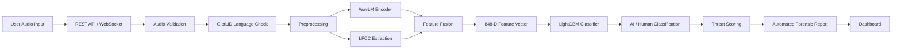
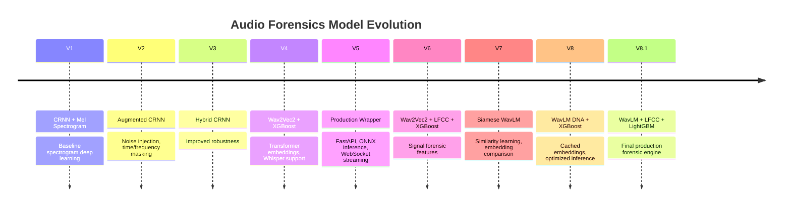

<div align="center">

# 🎙️ Audio Forensics
### AI for Voice Security

**A production-grade AI system for detecting synthetic speech, voice cloning, and AI-generated voice attacks — in real time.**


</div>

---

## 📖 Overview

**Audio Forensics** is an AI-powered voice security platform built to detect synthetic speech, AI-generated voices, and voice cloning attacks.

The system evolved through **8+ model generations** — moving from spectrogram-based deep learning to a production forensic engine that fuses:

- 🧬 Transformer speech representations
- 🔬 Signal-processing forensic features
- 🧩 Siamese similarity learning
- 🌲 Ensemble machine learning
- ⚡ Real-time WebSocket inference

### Key Capabilities

| Capability | Description |
|---|---|
| ✅ Static Forensic Analysis | Deep analysis of uploaded audio recordings |
| ✅ Real-Time Interception | Live voice stream monitoring via WebSocket |
| ✅ AI Speech Detection | Identifies AI-generated and cloned voices |
| ✅ Threat Scoring | Quantified risk assessment per analysis |
| ✅ Automated Forensic Reports | Structured, actionable security output |

---

## 📑 Table of Contents

- [Live Deployments](#-live-deployments)
- [System Architecture](#-system-architecture)
- [Model Evolution](#-model-evolution)
- [Dataset Intelligence](#-dataset-intelligence)
- [Language Identification (GlotLID)](#-language-identification-glotlid)
- [Synthetic Voice Generation Pipeline](#-synthetic-voice-generation-pipeline)
- [Audio Preprocessing](#-audio-preprocessing)
- [Feature Extraction](#-feature-extraction)
- [Data Augmentation](#-data-augmentation)
- [Testing & API Usage](#-testing--api-usage)
- [Frontend](#-frontend)
- [Threat Intelligence Report](#-threat-intelligence-report)
- [Performance](#-performance)
- [Technology Stack](#-technology-stack)
- [Security Practices](#-security-practices)
- [Notes](#-notes)
- [Contributors](#-contributors)
- [License](#-license)
- [Links](#-links)

---

## 🚀 Live Deployments

### Google Cloud Run — *Primary Production Deployment (archived)*

```
https://threat-engine-v8-810126162948.us-central1.run.app/
```

**Stack:** Docker · FastAPI · PyTorch · WavLM · Whisper · LightGBM · Google Cloud Container Registry

> Cloud Run was used because the full infrastructure lived inside Google Cloud. After validation, the service was stopped to avoid continuous billing.

### Hugging Face Spaces — *Current Public Backend*

```
https://venkatasriram-audio-forensics-v8-1-demo.hf.space
```

Provides: Static analysis API · WebSocket live streaming · V8.1 forensic inference

---

## 🧠 System Architecture



**Pipeline at a glance:** `Audio Input → REST/WebSocket → Validation → Preprocessing → WavLM + LFCC → Feature Fusion → LightGBM → Threat Report`

---

## 🧬 Model Evolution



<details>
<summary><b>Expand version-by-version details</b></summary>

| Version | Architecture | Highlights |
|---|---|---|
| **V1** | CRNN + Mel Spectrogram | Baseline; limited generalization, noise-sensitive |
| **V2** | Augmented CRNN | Added noise injection, time/frequency masking |
| **V3** | Hybrid CRNN | Improved augmentation strategy and generalization |
| **V4** | Wav2Vec2 + XGBoost | Major shift to transformer embeddings + Whisper |
| **V5** | Production Wrapper | FastAPI, ONNX inference, static + WebSocket API |
| **V6** | Wav2Vec2 + LFCC + XGBoost | Added phase analysis, better artifact detection |
| **V7** | Siamese WavLM | WavLM encoder, pair-based similarity training |
| **V8** | WavLM DNA + XGBoost | Clip-level cached embeddings, efficient inference |
| **V8.1** | WavLM + LFCC + LightGBM | **Final production engine — 99.84% accuracy** |

</details>

---

## 📊 Dataset Intelligence

The model is trained on a deliberately diverse mix of:

- Real human speech
- AI-generated synthetic speech
- Multilingual speech across multiple speakers
- Multiple TTS architectures

**Goal:** detect *synthetic artifacts* rather than memorizing language, speaker, or dataset bias.

### 🌍 Mozilla Data Collective

Built on **Mozilla's Open Voice Data Initiative**, a community-driven effort to democratize voice AI training data and increase representation of underrepresented languages (Kinyarwanda, Pashto, Bengali, and more).

| Metric | Value |
|---|---|
| Total Voice Samples (global initiative) | 10.4M+ |
| Languages Covered (global initiative) | 90+ |
| Contributors | 500,000+ |
| Base Clips Used for Training | 90,000 |
| Dataset Quality Score | 99.86% |

### ⚖️ Real vs. Synthetic Split

| Type | Count | Share | Source |
|---|---|---|---|
| **Real Audio** | 45,000 | 50% | Mozilla Data Collective speech recordings |
| **Synthetic Audio** | 45,000 | 50% | MMS · x-TTS · Microsoft Edge TTS · ElevenLabs v3 |

### 🗣️ Language Coverage

<details>
<summary><b>Expand full language-by-language breakdown</b></summary>

| Language | ISO 639-3 | Synthetic Engine | Mozilla Dataset Source |
|---|---|---|---|
| English | `eng` | x-TTS | Common Voice Scripted Speech 26.0 |
| French | `fra` | x-TTS | Common Voice Scripted Speech 26.0 |
| German | `deu` | x-TTS | Common Voice Scripted Speech 26.0 |
| Spanish | `spa` | x-TTS | Common Voice Scripted Speech 26.0 |
| Catalan | `cat` | MMS | Common Voice Scripted Speech 26.0 |
| Bengali | `ben` | MMS | Common Voice Scripted Speech 26.0 |
| Kinyarwanda | `kin` | MMS | Common Voice Scripted Speech 26.0 |
| Pashto | `pus/pbt/pbu` | Microsoft Edge-TTS (Azure Neural fallback) | Common Voice Scripted Speech 26.0 |
| Chinese | `zho/cmn` | Microsoft Edge-TTS (Azure Neural fallback) | Common Voice Scripted Speech 26.0 |

**Notes:**
- English provides the baseline acoustic foundation across multiple accents/regions.
- French covers metropolitan and African speech variants.
- German's phonetic complexity demands detailed acoustic analysis.
- Spanish spans Iberian and Latin American variations.
- Catalan, Bengali, and Kinyarwanda represent historically underrepresented communities.
- Pashto and Chinese require dedicated handling of complex consonant/tonal structures.

</details>

---

## 🔎 Language Identification (GlotLID)

GlotLID validates language identity **before training**, preventing incorrect labels, mixed-language samples, metadata errors, and misclassified recordings.

```text
Raw Audio Dataset
      ↓
Audio Extraction
      ↓
GlotLID Language Detection
      ↓
Confidence Filtering
      ↓
Valid Language Bucket
      ↓
Feature Extraction
      ↓
Model Training
```

**Processing steps:** Audio Loading → Language Detection (label + confidence score) → Metadata Verification (vs. dataset metadata, expected category, training labels) → Filtering

| Accepted ✅ | Rejected ❌ |
|---|---|
| Matching language | Wrong language |
| Valid confidence | Low confidence |
| Correct metadata | Corrupted samples |

---

## 🤖 Synthetic Voice Generation Pipeline

Synthetic speech sources used across the project: **OpenAI voice generation · Google Cloud TTS · Coqui XTTSv2 · Microsoft Edge TTS · gTTS · eSpeak** — used for voice cloning simulation, AI voice diversity, and robustness testing.

### 🎙️ ElevenLabs v3 Pipeline

A dedicated pipeline expanded the AI-generated speech dataset using the **ElevenLabs `eleven_v3`** model.

| Detail | Value |
|---|---|
| Clips generated | 7,700 synthetic clips |
| Target per language | 1,100 clips |
| Languages | English, German, French, Spanish, Chinese, Catalan, Bengali |
| Excluded at this stage | Kinyarwanda, Pashto |
| Voice diversity | 21 naturally sounding voices, dynamically fetched from the ElevenLabs voice library, randomly sampled per clip |

**Source transcription models** (real audio → text before synthesis):

| Languages | Transcription Model |
|---|---|
| English, German, French, Spanish, Chinese, Catalan | AssemblyAI Universal-3-Pro / Universal-2 |
| Bengali | OpenAI Whisper Small |

**Generation workflow:**

```text
Real Audio → Speech Transcription → Sentence Extraction
   → Random ElevenLabs Voice Selection → ElevenLabs eleven_v3 Generation
   → Synthetic Audio Output → Dataset Integration
```

**Reliability mechanisms:**
- Smart top-up & resume logic — tracks existing output per language, generates only missing samples, skips completed files, prevents duplicates
- Rate-limit resilience — exponential backoff, retry (max 3 attempts), increasing wait intervals, polite request delays

### ☁️ OpenAI & Google Cloud TTS Booster Pack

A focused **130-clip booster pack** stress-tests the meta-classifier against unseen, state-of-the-art TTS engines beyond the main training pipeline — improving generalization and reducing dependency on training-source artifacts.

| Engine | Clips Generated |
|---|---|
| Google Cloud TTS | 70 |
| OpenAI TTS | 60 |
| **Total** | **130** |

Each language used **20 validated authentic sentences** as the seed set, with the following vendor routing strategy:

| Sentence Range | Engine |
|---|---|
| First 10 sentences | Google Cloud TTS (Neural2 / WaveNet) |
| Next 10 sentences | OpenAI TTS — `tts-1-hd`, Nova voice |

- **Google Cloud TTS** covered English, French, Spanish, German, Chinese, Catalan, Bengali using Neural2, WaveNet, and Standard voices.
- **OpenAI TTS** (`tts-1-hd`, Nova voice) covered English, French, Spanish, German, Chinese, Catalan — Bengali was excluded due to language-support limitations and routed entirely through Google Cloud TTS.

<details>
<summary><b>Expand voice/model reference table</b></summary>

| Language | Google Cloud Voice | OpenAI Voice |
|---|---|---|
| English | Journey — `en-US-Journey-D` | Nova (`tts-1-hd`) |
| French | Neural2 — `fr-FR-Neural2-A` | Nova (`tts-1-hd`) |
| Spanish | Neural2 — `es-ES-Neural2-A` | Nova (`tts-1-hd`) |
| German | Neural2 — `de-DE-Neural2-B` | Nova (`tts-1-hd`) |
| Chinese (Mandarin) | WaveNet — `cmn-CN-Wavenet-A` | Nova (`tts-1-hd`) |
| Catalan | Standard — `ca-ES-Standard-A` | Nova (`tts-1-hd`) |
| Bengali | WaveNet — `bn-IN-Wavenet-A` | — (not supported) |

</details>

---

## 🔊 Audio Preprocessing

```text
Input Audio → Format Validation → FFmpeg Conversion → 16kHz Resampling
   → Mono Conversion → Noise Filtering → Silence Removal
   → RMS Filtering → Chunk Generation → Feature Extraction
```

**Standard format:** 16,000 Hz · Mono · WAV
**Techniques:** FFmpeg validation · RMS energy filtering · silence trimming · language verification

### 🌧️ Environmental Noise Augmentation

To prevent the detector from learning *"clean audio = synthetic"* as a shortcut, every generated clip receives randomized low-level white noise injection and real-world recording/environmental simulation — improving robustness for phone recordings, voice calls, microphone variation, and real deployment conditions.

---

## 🔬 Feature Extraction

| Feature | Introduced | Captures |
|---|---|---|
| Mel Spectrogram | Early CRNN versions (V1–V3) | Basic time-frequency representation |
| Wav2Vec2 | V4 | Contextual speech representations |
| WavLM | V7, V8, V8.1 | Speaker information, speech structure, synthetic artifacts |
| LFCC | V6, optimized in V8.1 | Frequency inconsistencies, micro spectral artifacts |

---

## 🎛️ Data Augmentation

- Background noise injection
- Time masking / frequency masking
- Telephonic channel simulation
- Band-pass filtering
- Compression degradation

---

## 🧪 Testing & API Usage

### Static Analysis

**Endpoint:** `/analyze`

```python
import requests

url = "https://venkatasriram-audio-forensics-v8-1-demo.hf.space/analyze"

files = {
    "file": open("sample.wav", "rb")
}

response = requests.post(url, files=files)
print(response.json())
```

**Returns:** threat status · AI probability · human probability · language detection · action report

### 🎧 Live Streaming Testing

**File:** `live_stream_tester_v8_1.py`

```bash
pip install websockets librosa numpy nest_asyncio
```

```python
uri = "wss://venkatasriram-audio-forensics-v8-1-demo.hf.space/ws/stream"
TEST_FILE = "sample.wav"
```

```bash
python live_stream_tester_v8_1.py
```

**Process:** Load audio → Convert to 16kHz mono → Split into 0.5s chunks → Stream via WebSocket → Receive live predictions → Generate forensic report

---

## 🖥️ Frontend

**Built with:** React · Vite · Tailwind CSS · shadcn/ui · WebSockets · Firebase

**Features:** Authentication · Analysis history · Dashboard · Threat visualization · Real-time inference display

```text
React UI → WebSocket Client → FastAPI Backend → V8.1 Forensic Engine → Threat Report
```

| Component | Status |
|---|---|
| Backend | ✅ Deployed |
| AI Engine | ✅ Available |
| Frontend | ❌ Private / local only |

> The frontend repository is kept private because Firebase stores user records, authentication data, and analysis history.

### Multilingual Security (Runtime Detection)

| Language | Code | Synthetic Engines Evaluated |
|---|---|---|
| English | eng | x-TTS, Google TTS, OpenAI TTS |
| French | fra | x-TTS, Google TTS, OpenAI TTS |
| German | deu | x-TTS, Google TTS, OpenAI TTS |
| Spanish | spa | x-TTS, Google TTS, OpenAI TTS |
| Catalan | cat | MMS, Google TTS, OpenAI TTS |
| Bengali | ben | MMS, Google TTS |
| Kinyarwanda | kin | MMS |
| Pashto | pus/pbt/pbu | Edge TTS |
| Chinese | zho/cmn | Edge TTS, Google TTS, OpenAI TTS |

The detector identifies unnatural frequency transitions, robotic breathing patterns, artificial emotional expression, spectral inconsistencies, and phase anomalies to distinguish **authentic human voice** from **AI-generated synthetic voice**, in real time.

---

## 🛡️ Threat Intelligence Report

Each analysis generates a structured forensic report:

```json
{
  "threat_status": "AI Generated | Human",
  "ai_probability": "...",
  "human_probability": "...",
  "detected_language": "...",
  "confidence_score": "...",
  "recommended_action": "..."
}
```

---

## 📈 Performance

| Metric | Value |
|---|---|
| Model | V8.1 |
| Architecture | WavLM + LFCC + LightGBM |
| Feature Size | 848 dimensions |
| **Accuracy** | **99.84%** |

---

## 📦 Technology Stack

| Category | Technologies |
|---|---|
| **AI / ML** | PyTorch, WavLM, Wav2Vec2, Whisper, LFCC, LightGBM, XGBoost, Siamese Networks |
| **Backend** | FastAPI, WebSockets, ONNX Runtime, Docker |
| **Deployment** | Google Cloud Run, Hugging Face Spaces, Google Cloud Container Registry |
| **Frontend** | React, Vite, Tailwind CSS, shadcn/ui, Firebase |

---

## 🔐 Security Practices

- ✅ Do not upload datasets publicly
- ✅ Do not commit Firebase credentials
- ✅ Do not commit model weights without Git LFS
- ✅ Keep API keys private
- ✅ Store production secrets using environment variables

---

## ⚠️ Notes

- Version 5 is a production wrapper around Version 4.
- Version 8.1 is the final production forensic engine.
- Synthetic datasets are generated only for research and robustness evaluation.
- Public deployment does not expose private datasets or model weights.

---

## 👥 Contributors

**Ayush M Singh**
Model development · Backend engineering · AI pipeline design · Dataset processing · Deployment architecture · System optimization

---

## 📄 License

No license file is currently included in this repository. Add a `LICENSE` file to clarify reuse and distribution terms.

---

## 🔗 Links

| Resource | URL |
|---|---|
| Repository | https://github.com/AYUSHMSINGH2004/Audio-Forensics---AI-For-Voice-Security |
| Backend Demo | https://venkatasriram-audio-forensics-v8-1-demo.hf.space |

---

<div align="center">

### 🏁 Project Summary

Audio Forensics demonstrates a complete production-grade AI security pipeline for detecting synthetic voices and voice cloning attacks — combining transformer speech intelligence, signal-level forensic analysis, multilingual datasets, synthetic voice simulation, ensemble classification, and real-time inference.

*Detecting synthetic voices. Protecting authentic communication. Building safer voice AI.*

</div>
