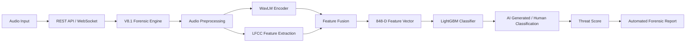
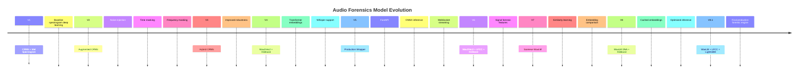
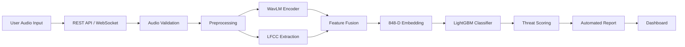

# 🎙️ Audio Forensics: AI for Voice Security

## 🛡️ Production-Grade AI Voice Deepfake Detection System

Audio Forensics is an AI-powered voice security platform designed to detect synthetic speech, AI-generated voices, and voice cloning attacks.

The system evolved through **8+ model generations**, moving from spectrogram-based deep learning into a production forensic engine combining:

* Transformer speech representations
* Signal-processing forensic features
* Siamese similarity learning
* Ensemble machine learning
* Real-time WebSocket inference

Supports:

✅ Static audio forensic analysis
✅ Real-time voice interception simulation
✅ AI-generated speech detection
✅ Threat scoring
✅ Automated forensic reports

---

# 🚀 Deployment

## Google Cloud Run (Primary Production Deployment)

Original production deployment:

```
https://threat-engine-v8-810126162948.us-central1.run.app/
```

Stack:

* Docker
* FastAPI
* PyTorch
* WavLM
* Whisper
* LightGBM
* Google Cloud Container Registry

Cloud Run was used because the complete infrastructure was inside Google Cloud. After validation, the service was stopped to avoid continuous billing.

---

## Hugging Face Spaces Demo Deployment

Current public backend:

```
https://venkatasriram-audio-forensics-v8-1-demo.hf.space
```

Provides:

* Static analysis API
* WebSocket live streaming
* V8.1 forensic inference

---

# 🧠 System Architecture



Pipeline:

```
Audio Input
↓
REST/WebSocket
↓
V8.1 Engine
↓
WavLM + LFCC
↓
Feature Fusion
↓
LightGBM
↓
Threat Report
```

---

# 📊 Dataset Intelligence Pipeline

The model uses:

* Real human speech
* AI-generated synthetic speech
* Multilingual speech
* Multiple speakers
* Multiple TTS architectures

Goal:

Detect synthetic artifacts instead of memorizing language, speaker, or dataset bias.

---

# 🌍 Multilingual Dataset Intelligence

## Built on Mozilla's Open Voice Data Initiative

We proudly utilize the Mozilla Data Collective, a pioneering open-source initiative dedicated to democratizing voice AI training data.

Mozilla's community-driven approach enables researchers and developers to build fairer and more inclusive speech systems by increasing representation of historically underrepresented languages such as:

* Kinyarwanda
* Pashto
* Bengali

The Audio Forensics threat detection baseline was trained using publicly available Mozilla voice datasets, demonstrating how transparent, community-driven datasets are essential for reducing AI bias and improving responsible voice security.

## Mozilla Data Collective Scale

```
10.4M+ Voice Samples

90+ Global Languages

500,000+ Contributors
```

---

# Dataset Foundation

## Mozilla Data Collective

```
99.86%
90,000 audio clips
```

Primary foundation of the multilingual dataset.

Provides:

* Diverse speaker coverage
* Global language representation
* Open-source speech resources
* Community verified recordings

---

# Audio Clips Breakdown

## Real Audio Clips

```
45,000
50%
```

Source:

Mozilla Data Collective speech recordings

---

## Synthetic Audio Clips

```
45,000
50%
```

Generated from real speech using:

* MMS
* x-TTS
* Microsoft Edge TTS
* ElevenLabs v3

---

# 🌐 Multilingual Threat Detection & Protection

The multilingual threat detection framework provides comprehensive voice authentication across nine languages through advanced acoustic analysis.

By combining:

* Diverse multilingual datasets
* Synthetic voice generation
* Transformer speech embeddings
* Signal forensic features

the system identifies:

* Unnatural frequency transitions
* Robotic breathing patterns
* Artificial emotional expression
* Spectral inconsistencies
* Phase anomalies

The detector operates in real-time by analyzing acoustic fingerprints and speech structure to distinguish:

```
Authentic Human Voice

vs

AI Generated Synthetic Voice
```

Supported languages:

* English
* French
* German
* Spanish
* Catalan
* Bengali
* Kinyarwanda
* Pashto
* Chinese

---

# 🗣️ Language Dataset Coverage

## English

```
ISO 639-3:
eng

Synthetic Model:
x-TTS
```

Mozilla Dataset:

```
Common Voice Scripted Speech 26.0 - English
```

English provides the baseline acoustic foundation with multiple accents and regional variations.

---

## French

```
ISO 639-3:
fra

Synthetic Model:
x-TTS
```

Mozilla Dataset:

```
Common Voice Scripted Speech 26.0 - French
```

French coverage includes metropolitan and African speech variants.

---

## German

```
ISO 639-3:
deu

Synthetic Model:
x-TTS
```

Mozilla Dataset:

```
Common Voice Scripted Speech 26.0 - German
```

German phonetic complexity requires detailed acoustic analysis for synthetic detection.

---

## Spanish

```
ISO 639-3:
spa

Synthetic Model:
x-TTS
```

Mozilla Dataset:

```
Common Voice Scripted Speech 26.0 - Spanish
```

Includes Iberian and Latin American speech variations.

---

## Catalan

```
ISO 639-3:
cat

Synthetic Model:
MMS
```

Mozilla Dataset:

```
Common Voice Scripted Speech 26.0 - Catalan
```

Represents underrepresented linguistic communities.

---

## Bengali

```
ISO 639-3:
ben

Synthetic Model:
MMS
```

Mozilla Dataset:

```
Common Voice Scripted Speech 26.0 - Bengali
```

Captures South Asian phonetic diversity.

---

## Kinyarwanda

```
ISO 639-3:
kin

Synthetic Model:
MMS
```

Mozilla Dataset:

```
Common Voice Scripted Speech 26.0 - Kinyarwanda
```

Supports African language representation in AI security.

---

## Pashto

```
ISO 639-3:
pus/pbt/pbu

Synthetic Model:
Microsoft Edge-TTS Engine
(Azure Neural Fallback)
```

Mozilla Dataset:

```
Common Voice Scripted Speech 26.0 - Pashto
```

Handles complex consonant structures and tonal variations.

---

## Chinese

```
ISO 639-3:
zho/cmn

Synthetic Model:
Microsoft Edge-TTS Engine
(Azure Neural Fallback)
```

Mozilla Dataset:

```
Common Voice Scripted Speech 26.0 - Chinese
```

Supports Mandarin tonal and prosodic analysis.

---

# 🔎 GlotLID Language Identification Pipeline

GlotLID is integrated to validate language before training.

Prevents:

* Incorrect language labels
* Mixed-language samples
* Metadata errors
* Misclassified recordings

Workflow:

```
Raw Audio Dataset

↓

Audio Extraction

↓

GlotLID Language Detection

↓

Confidence Filtering

↓

Valid Language Bucket

↓

Feature Extraction

↓

Model Training
```

---

# GlotLID Processing Steps

## 1. Audio Loading

Audio files are decoded and converted into standardized waveforms.

---

## 2. Language Detection

GlotLID predicts:

```
Detected Language
+
Confidence Score
```

---

## 3. Metadata Verification

Compared with:

* Dataset metadata
* Expected language category
* Training labels

---

## 4. Filtering

Accepted:

✅ Matching language
✅ Valid confidence
✅ Correct metadata

Rejected:

❌ Wrong language
❌ Low confidence
❌ Corrupted samples

---
# 🔊 Audio Preprocessing

Pipeline:

```id="1f23af"
Input Audio

↓

Format Validation

↓

FFmpeg Conversion

↓

16kHz Resampling

↓

Mono Conversion

↓

Noise Filtering

↓

Silence Removal

↓

RMS Filtering

↓

Chunk Generation

↓

Feature Extraction
```

Standard:

* 16000 Hz
* Mono
* WAV

Techniques:

* FFmpeg validation
* RMS energy filtering
* Silence trimming
* Language verification

---

# 🤖 Synthetic Voice Generation

Synthetic sources:

* OpenAI voice generation
* Google Cloud TTS
* Coqui XTTSv2
* Microsoft Edge TTS
* gTTS
* eSpeak

Used for:

* Voice cloning simulation
* AI voice diversity
* Robustness testing

---

# 🎙️ ElevenLabs v3 Synthetic Audio Generation Pipeline

A dedicated synthetic voice generation pipeline was created to expand the AI-generated speech dataset using the **ElevenLabs eleven_v3 model**.

## Dataset Expansion

Generated:

```id="q2xg7r"
7,700 synthetic audio clips
```

Languages:

* English
* German
* French
* Spanish
* Chinese
* Catalan
* Bengali

Target:

```id="6a9v9q"
1,100 synthetic clips per language
```

Excluded from this generation stage:

* Kinyarwanda
* Pashto

---

# 🗣️ Comprehensive Vocal Diversity

To maximize synthetic voice diversity:

* 21 naturally sounding speaker voices were used
* Voices were dynamically fetched from ElevenLabs voice library
* Multiple speaker identities were randomly sampled

This prevents overfitting to a single synthetic speaker profile.

---

# 🔎 Voice Pool Sourcing

Premade natural voices were dynamically fetched.

Benefits:

* Increased speaker variation
* Better synthetic artifact coverage
* More realistic TTS diversity

---

# 📝 Source Transcription Pipeline

Real speech clips were converted into text before synthesis.

Transcription models:

## English, German, French, Spanish, Chinese, Catalan

Used:

* AssemblyAI Universal-3-Pro
* AssemblyAI Universal-2

## Bengali

Used:

* OpenAI Whisper Small

---

# 🔊 Synthetic Voice Generation Workflow

```id="0n2y8d"
Real Audio

↓

Speech Transcription

↓

Sentence Extraction

↓

Random ElevenLabs Voice Selection

↓

ElevenLabs eleven_v3 Generation

↓

Synthetic Audio Output

↓

Dataset Integration
```

Each sentence was synthesized using:

* ElevenLabs eleven_v3
* Random premade voices

to create realistic synthetic counterparts.

---

# ⚡ Smart Top-Up & Resume Logic

The generation pipeline includes automatic progress tracking.

Features:

* Checks existing output per language
* Generates only missing samples
* Maintains 1,100 clips per language
* Skips completed files
* Prevents duplicate generation

---

# 🛡️ Rate-Limit Resilience

API reliability mechanisms:

* Exponential backoff
* Retry mechanism
* Maximum 3 attempts
* Increasing wait intervals
* Polite request delays

This ensures stable large-scale dataset generation.

---

# 🚀 OpenAI & Google Cloud TTS Audio Generation

A focused **130-clip synthetic booster pack** was generated to stress-test the final Audio Forensics meta-classifier against unseen, state-of-the-art TTS engines beyond the main training pipeline.

Purpose:

* Evaluate generalization
* Test unseen synthesis engines
* Reduce dependency on training-source artifacts
* Validate production robustness

The booster pack used:

```id="d5o5z6"
20 validated authentic sentences per language
```

---

# Synthetic Booster Pack Generation

Generated:

```id="f5j1p3"
Google Cloud TTS:
70 clips

OpenAI TTS:
60 clips

Total:
130 synthetic clips
```

---

# ☁️ Google Cloud TTS Generation

Google Cloud Text-to-Speech was used across seven languages.

Models:

* Neural2
* WaveNet
* Standard voices

Generated languages:

* English
* French
* Spanish
* German
* Chinese
* Catalan
* Bengali

---

# 🤖 OpenAI TTS Generation

OpenAI Text-to-Speech used:

```id="z1w7m9"
Model:
tts-1-hd

Voice:
Nova
```

Supported languages:

* English
* French
* Spanish
* German
* Chinese
* Catalan

Note:

Bengali was excluded from the OpenAI branch because of language support limitations and routed entirely through Google Cloud TTS.

---

# 🔀 Vendor Routing Strategy

For each supported language:

First 10 sentences:

```id="5r6v2d"
Google Cloud TTS
(Neural2 / WaveNet)
```

Next 10 sentences:

```id="7t2h6n"
OpenAI TTS
tts-1-hd
Nova Voice
```

This created a balanced evaluation set across different synthesis engines.

---

# 🌎 Voices & Speaker Models Used

## Google Cloud TTS

### English

```id="1q4s7w"
Journey
en-US-Journey-D
```

---

### French

```id="s4x8u2"
Neural2
fr-FR-Neural2-A
```

---

### Spanish

```id="h8p2x4"
Neural2
es-ES-Neural2-A
```

---

### German

```id="m6k9z1"
Neural2
de-DE-Neural2-B
```

---

### Chinese Mandarin

```id="c7n3v5"
WaveNet
cmn-CN-Wavenet-A
```

---

### Catalan

```id="r9v1k8"
Standard
ca-ES-Standard-A
```

---

### Bengali

```id="b2m5x7"
WaveNet
bn-IN-Wavenet-A
```

---

# OpenAI TTS Voice

Primary model:

```id="w8n4q3"
Voice:
Nova

Model:
tts-1-hd
```

Languages:

* English
* French
* Spanish
* German
* Chinese
* Catalan

---

# 🌧️ Environmental Noise Augmentation

To prevent the detector from learning:

```id="z5p9m1"
"clean audio = synthetic"
```

as a shortcut,

every generated clip received:

* Randomized low-level white noise injection
* Real-world recording simulation
* Environmental degradation

This improves robustness against:

* Phone recordings
* Voice calls
* Microphone variations
* Real deployment conditions

---

# 🎛️ Data Augmentation

Includes:

* Background noise injection
* Time masking
* Frequency masking
* Telephonic channel simulation
* Band-pass filtering
* Compression degradation

---

# 🔬 Feature Extraction

## Mel Spectrogram

Used in early CRNN versions.

---

## Wav2Vec2

Introduced in V4.

Learns contextual speech representations.

---

## WavLM

Used in V7, V8, V8.1.

Captures:

* Speaker information
* Speech structure
* Synthetic artifacts

---

## LFCC

Used in V6 and optimized in V8.1.

Captures:

* Frequency inconsistencies
* Micro spectral artifacts

---

# 🧬 Model Evolution Journey



---

# V1 — CRNN + Mel Spectrogram

Initial baseline using spectrogram-based deep learning.

Limitations:

* Limited generalization
* Sensitive to noise

---

# V2 — Augmented CRNN

Added:

* Noise injection
* Time masking
* Frequency masking

Improved robustness.

---

# V3 — Hybrid CRNN

Improved augmentation strategy and generalization.

---

# V4 — Wav2Vec2 + XGBoost

Major transition into transformer embeddings.

Added:

* Wav2Vec2 features
* Whisper language support
* XGBoost classifier

---

# V5 — Production Wrapper

Converted V4 into deployable infrastructure.

Added:

* FastAPI
* ONNX inference
* Static API
* WebSocket streaming

V5 was a production wrapper around V4.

---

# V6 — Wav2Vec2 + LFCC + XGBoost

Added:

* LFCC features
* Phase analysis
* Better artifact detection

---

# V7 — Siamese WavLM

Introduced similarity learning.

Added:

* WavLM encoder
* Pair-based training
* Embedding comparison

---

# V8 — WavLM DNA + XGBoost

Production optimization:

* Clip-level embeddings
* Cached features
* Efficient inference

---

# V8.1 — WavLM + LFCC + LightGBM

Final production forensic engine.

Architecture:

```id="n5x8r2"
Audio

↓

WavLM Encoder

+

LFCC Extraction

↓

848-D Feature Vector

↓

LightGBM

↓

AI / Human Classification
```

Accuracy:

```id="m3v8q0"
99.84%
```
# 🧪 Testing

## Static Analysis

Endpoint:

```id="9n3w0a"
/analyze
```

Example:

```python id="s7m3k2"
import requests

url="https://venkatasriram-audio-forensics-v8-1-demo.hf.space/analyze"

files={
    "file":open("sample.wav","rb")
}

response = requests.post(
    url,
    files=files
)

print(response.json())
```

Returns:

* Threat status
* AI probability
* Human probability
* Language detection
* Action report

---

# 🎧 Live Streaming Testing

File:

```id="u4m9c2"
live_stream_tester_v8_1.py
```

Install:

```bash id="v2n6x8"
pip install websockets librosa numpy nest_asyncio
```

Configure:

```python id="r8q1w5"
uri="wss://venkatasriram-audio-forensics-v8-1-demo.hf.space/ws/stream"

TEST_FILE="sample.wav"
```

Run:

```bash id="a6y3p9"
python live_stream_tester_v8_1.py
```

Process:

1. Load audio
2. Convert to 16kHz mono
3. Split into 0.5 second chunks
4. Stream through WebSocket
5. Receive live predictions
6. Generate forensic report

---

# 🖥️ Frontend

Built with:

* React
* Vite
* Tailwind CSS
* shadcn/ui
* WebSockets
* Firebase

Features:

* Authentication
* Analysis history
* Dashboard
* Threat visualization
* Real-time inference display

Frontend architecture:

```id="k2m8v4"
React UI

↓

WebSocket Client

↓

FastAPI Backend

↓

V8.1 Forensic Engine

↓

Threat Report
```

Frontend is private because Firebase stores:

* User records
* Authentication data
* Analysis history

Status:

✅ Backend deployed
✅ AI Engine available
❌ Frontend private/local only

---

# 📊 Final System Capabilities

The final Audio Forensics V8.1 system provides:

## Static Audio Forensics

Analyzes uploaded recordings and detects:

* AI-generated speech
* Voice cloning attempts
* Synthetic artifacts
* Suspicious acoustic patterns

---

## Real-Time Voice Monitoring

Supports:

* WebSocket streaming
* Chunk-based inference
* Live threat scoring
* Continuous analysis

---

## Multilingual Security

Supported languages:

| Language    | Code        | Synthetic Engines                |
| ----------- | ----------- | -------------------------------- |
| English     | eng         | x-TTS, Google TTS, OpenAI TTS    |
| French      | fra         | x-TTS, Google TTS, OpenAI TTS    |
| German      | deu         | x-TTS, Google TTS, OpenAI TTS    |
| Spanish     | spa         | x-TTS, Google TTS, OpenAI TTS    |
| Catalan     | cat         | MMS, Google TTS, OpenAI TTS      |
| Bengali     | ben         | MMS, Google TTS                  |
| Kinyarwanda | kin         | MMS                              |
| Pashto      | pus/pbt/pbu | Edge TTS                         |
| Chinese     | zho/cmn     | Edge TTS, Google TTS, OpenAI TTS |

---

# 🛡️ Threat Intelligence Output

Each analysis generates:

```id="x7q3m8"
Forensic Report

{

Threat Status:
AI Generated / Human

AI Probability:

Human Probability:

Detected Language:

Confidence Score:

Recommended Action:

}
```

---

# ⚙️ Production Architecture

Complete pipeline:



---

# 📦 Technology Stack

## AI / ML

* PyTorch
* WavLM
* Wav2Vec2
* Whisper
* LFCC
* LightGBM
* XGBoost
* Siamese Networks

---

## Backend

* FastAPI
* WebSockets
* ONNX Runtime
* Docker

---

## Deployment

* Google Cloud Run
* Hugging Face Spaces
* Google Cloud Container Registry

---

## Frontend

* React
* Vite
* Tailwind CSS
* shadcn/ui
* Firebase

---

# 📈 Performance

Final production engine:

```id="c4m7x2"
Model:
V8.1

Architecture:
WavLM + LFCC + LightGBM

Feature Size:
848 dimensions

Accuracy:
99.84%
```

---

# 🔐 Security Practices

Important deployment rules:

✅ Do not upload datasets publicly

✅ Do not commit Firebase credentials

✅ Do not commit model weights without Git LFS

✅ Keep API keys private

✅ Store production secrets using environment variables

---

# ⚠️ Notes

* Version 5 is a production wrapper around Version 4.
* Version 8.1 is the final production forensic engine.
* Synthetic datasets are generated only for research and robustness evaluation.
* Public deployment does not expose private datasets or model weights.

---

# 👥 Contributors

## Ayush M Singh

Responsibilities:

* Model development
* Backend engineering
* AI pipeline design
* Dataset processing
* Deployment architecture
* System optimization

---

# 🔗 Links

## Repository

```id="r3v9q5"
https://github.com/AYUSHMSINGH2004/Audio-Forensics---AI-For-Voice-Security
```

## Backend Demo

```id="p8m2z6"
https://venkatasriram-audio-forensics-v8-1-demo.hf.space
```

---

# 🏁 Project Summary

Audio Forensics demonstrates a complete production-grade AI security pipeline for detecting synthetic voices and voice cloning attacks.

The system combines:

* Transformer speech intelligence
* Signal-level forensic analysis
* Multilingual datasets
* Synthetic voice simulation
* Ensemble classification
* Real-time inference

By leveraging diverse open-source speech resources and modern AI architectures, the platform aims to provide scalable protection against emerging voice-based threats.

---

# ⭐ Final Architecture Overview

```id="w6n1c9"
Audio Input

↓

Multilingual Validation
(GlotLID)

↓

Preprocessing

↓

WavLM Representation

+

LFCC Forensic Features

↓

848-D Feature Fusion

↓

LightGBM Meta Classifier

↓

Threat Intelligence Engine

↓

Real-Time Security Report
```

---

# 🎙️ Audio Forensics

## AI for Voice Security

Detecting synthetic voices.

Protecting authentic communication.

Building safer voice AI.
